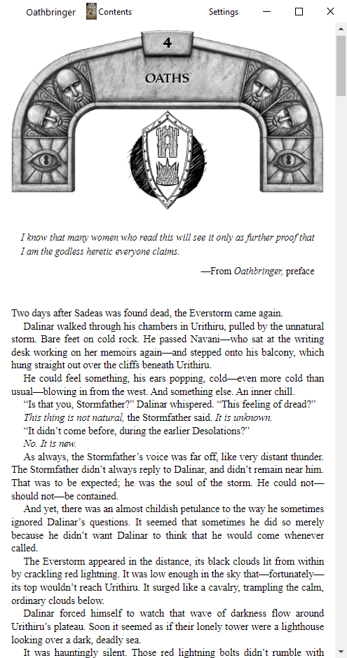
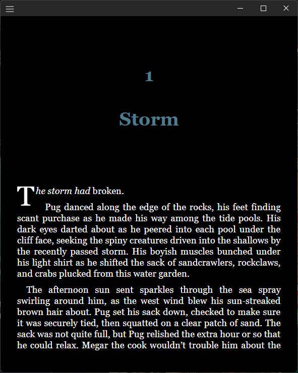

# Work in Progress
Using [Lectors](https://github.com/BasioMeusPuga/Lector/blob/master/lector/parsers/epub.py) EPUB Parser for metadata and library covers

Also Using [epubjs](https://github.com/futurepress/epub.js/tree/master) library

#[PyQt-Fluent-Widgets](https://github.com/zhiyiYo/PyQt-Fluent-Widgets/tree/master)
----
app is buggy  
things may not work

___

# Library

# Reader

## Compatibility

Only tested on Windows 10, Fedora 37 VM

# Usage
clone repo  
pip install -r requirements.txt  
python main.py 

### Todo
- [ ] Add a ToC view
- [X] Better Web View 
- [X] fix qwebchannel
- [ ] pages?
- [X] using epubjs library
- [ ] read where last read
- [ ] add annotations
