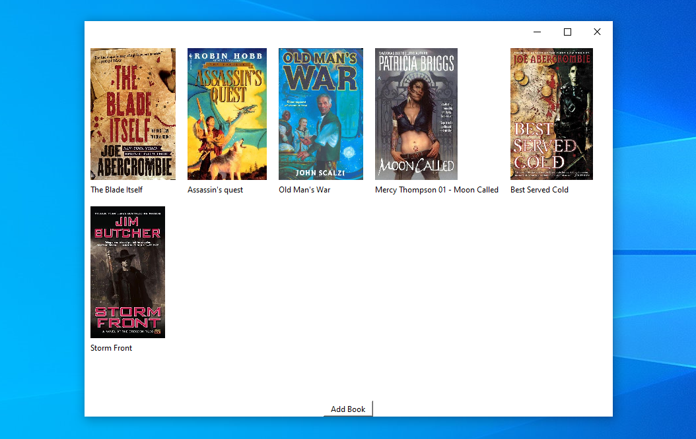
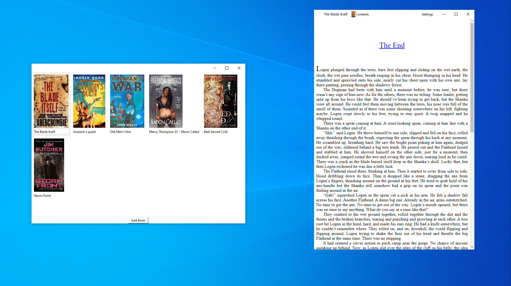

# Work in Progress

Using Lectors EPUB Parser\
https://github.com/BasioMeusPuga/Lector/blob/master/lector/parsers/epub.py 

## Compatibility
Only tested on Windows 10

# Library

# Reader & Library

### Todo
- [ ] fix table view
- [X] open book at last scroll location
- [ ] add toc view
- [ ] better resizing on reader view
- [ ] fix bookhandler 
- [ ] add more settings
  - [ ] font-family
  - [ ] font-color
  - [ ] background-color
  - [ ] default presets 
- [ ] add threads?
- [ ] use different database
  