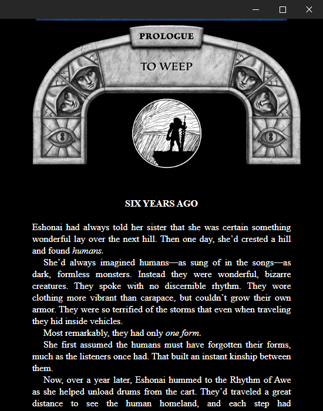

# Work in Progress
Using Lectors EPUB Parser\
https://github.com/BasioMeusPuga/Lector/blob/master/lector/parsers/epub.py

Using https://github.com/zhiyiYo/PyQt-Fluent-Widgets/tree/master

app is buggy  
things may not work

# Library

# Reader

## Compatibility

Only tested on Windows 10, Fedora 37 VM

# Usage

clone repo  
pip install -r requirements.txt  
python main.py 

### Todo
- [ ] Add a ToC view
- [X] Better Web View 
- [X] fix qwebchannel
- [ ] pages?
- [X] using epubjs library
- [ ] read where last read
- [ ] add annotations
