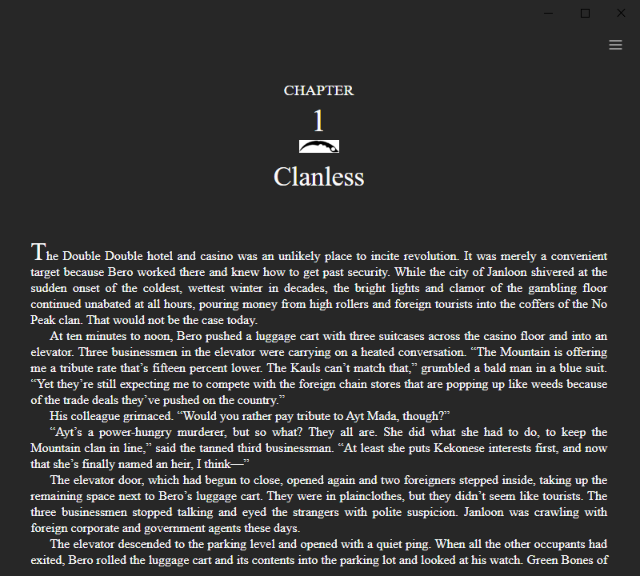

# Work in Progress

Using Lectors EPUB Parser\
https://github.com/BasioMeusPuga/Lector/blob/master/lector/parsers/epub.py

## Compatibility

Only tested on Windows 10

# Usage

pip install -r requirements.txt  
python app.py

# Library

# Reader

### Todo
- [ ] add support for  linux
- [ ] fix table view
- [x] open book at last scroll location
- [ ] add toc view
- [ ] better resizing on reader view
- [ ] add more settings
  - [ ] font-family
  - [ ] font-color
  - [ ] background-color
- [x] use different database
- [ ] better way to communicate with javascript in webview
- [ ] fix imports
