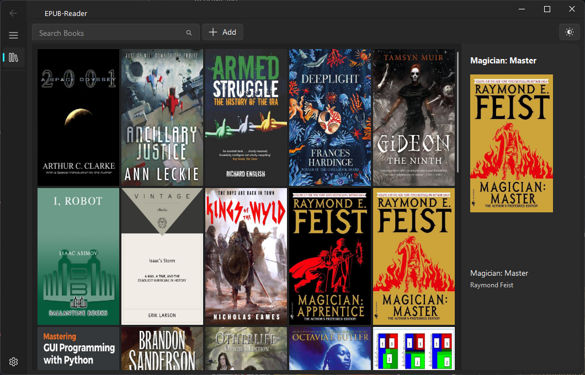

# Work in Progress
Using Lectors EPUB Parser\
https://github.com/BasioMeusPuga/Lector/blob/master/lector/parsers/epub.py

Using https://github.com/zhiyiYo/PyQt-Fluent-Widgets/tree/master

# Library

# Reader

## Compatibility

Only tested on Windows 10

# Usage

pip install -r requirements.txt  
python main.py

### Todo
